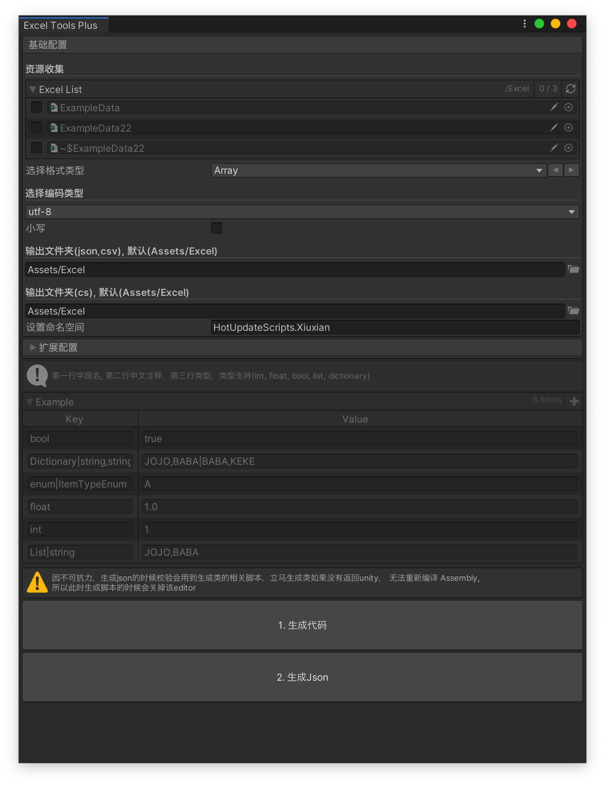
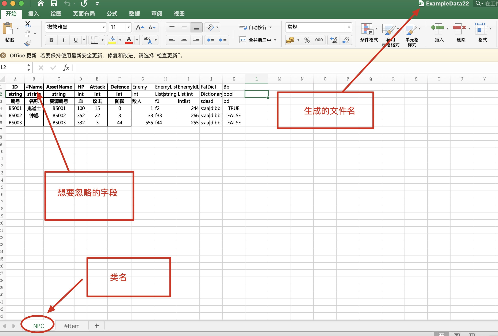
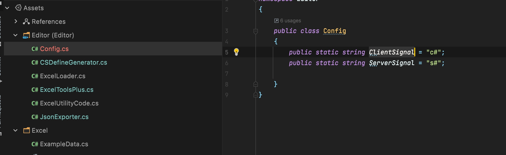

# UnityExcelTool
> 工具依赖odin, 购买地址[odin](https://assetstore.unity.com/packages/tools/utilities/odin-inspector-and-serializer-89041)
> 快捷键`command + e`
## 支持类型
`json`
## 格式
默认第一行为字段名，第二行字段类型，第三行中文注释

## 字段注释注意点
如果字段不想被输出  需要在字段key前面加`#`
字典的key不能为int

## 字段名命名规范
* `int 12` (整型)
* `int32 12`(整型)
* `short 12`(短整型)
* `long 12`(长整型)
* `string av`
* `List|string f1|f2`
* `string[] f1|f2`
* `Dictionary|string,string  s:aa|d:bb|f:cc`
* `dic<string,string>  s:aa|d:bb|f:cc`
* `map<string,string>  s:aa|d:bb|f:cc`
* `<string,string>  s:aa|d:bb|f:cc`
* `bool  true`
* `enum|ItemTypeEnum, A `

## 转换文件存放位置
* 默认Assets/Excel， 可自行修改
## 输出地方
* 支持设置CS文件及Json文件输出位置，如未设置默认Assets/Excel

## 额外支持
* 支持过滤服务端相关字段

## example
excel: [ExampleData22](media/ExampleData22.xlsx)
json: [ExampleData22](media/ExampleData22.json)
cs: [ExampleData22](media/ExampleData22.cs)
