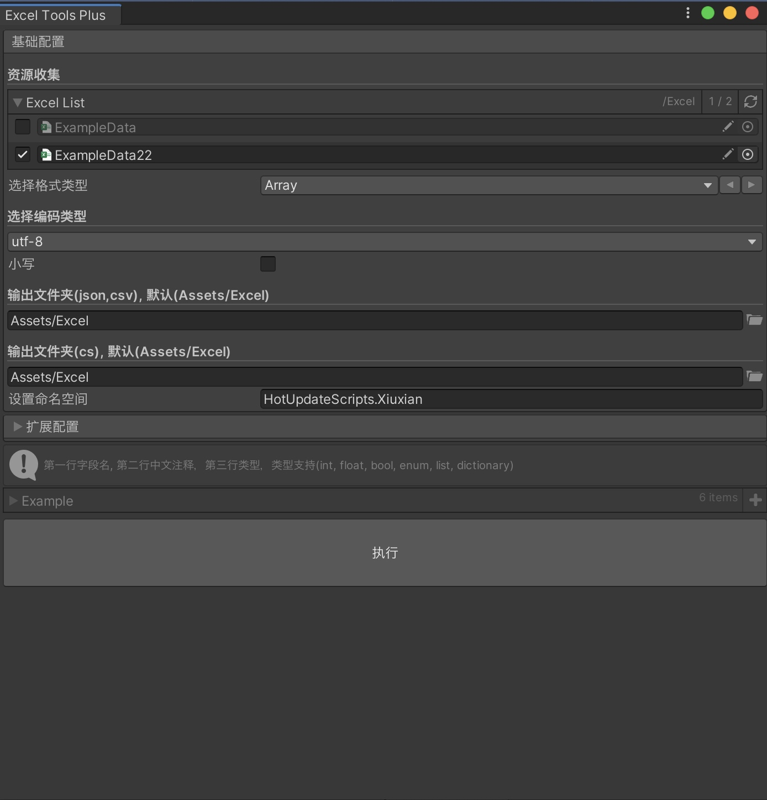
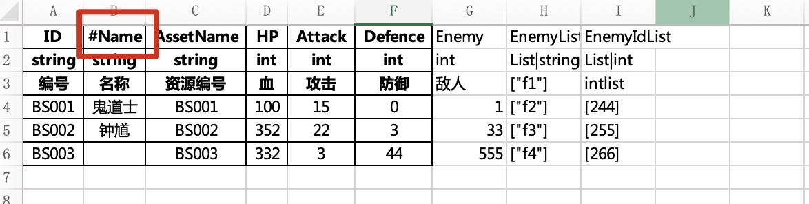

# UnityExcelTool

## 支持类型
`json`
## 格式
默认第一行为字段名，第二行字段类型，第三行中文注释

## 字段注释注意点
如果字段不想被输出  需要在字段key前面加`#`

## 字段名命名规范

## 转换文件存放位置
* 默认Assets/Excel， 可自行修改
## 输出地方
* 支持设置CS文件及Json文件输出位置，如未设置默认Assets/Excel
