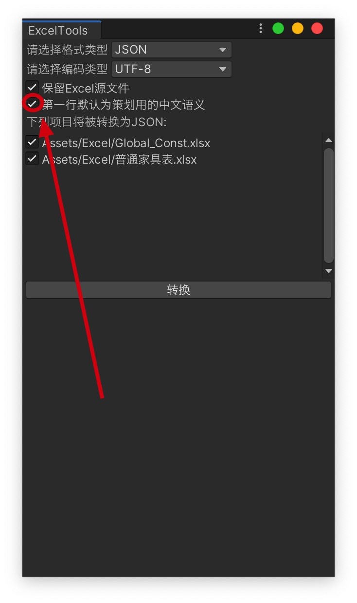

# UnityExcelTool
> 项目参考了[Excel2Unity](https://github.com/qinyuanpei/Excel2Unity)并进行了魔改
## 支持类型
`json, csv`
## 格式
默认第一行为中文注释，如果不需要中文注释则取消勾选

## 字段注释注意点
如果字段不想被输出  需要在字段key前面加`!`或者`#`

## 输出地方
* 支持选中想要进行转换的文件
* 支持在Assets/Excel下的文件直接转换，无需选中
